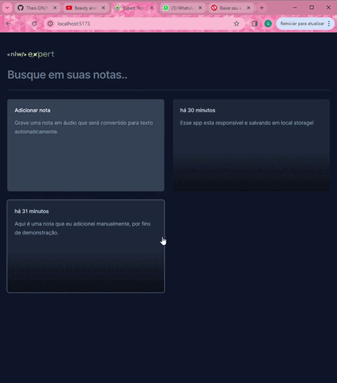

# Expert Notes

Uma aplicação de anotações pessoais intuitiva e ágil, construída com Next.js. O Expert Notes permite que você crie suas notas em tempo real. Com um design responsivo e uma interface de usuário polida, é a ferramenta perfeita para manter suas ideias organizadas em qualquer dispositivo.

## Características

-   **Criação de Notas:** Crie notas instantaneamente com apenas um clique.
-   **Crie usando o seu audio:** Crie notas falando enquanto o computador digita para você,podendo ver o que ele esta escrevendo em tempo real.
-   **Responsividade:** Acesse suas notas em qualquer dispositivo, a qualquer hora.
-   **Armazenamento Local:** Suas notas são salvas de forma segura no armazenamento local.

## Demonstração

Aqui está uma rápida demonstração de como o Expert Notes funciona:

Desenvolvido com o grupo da Rocketseat (https://nlw-expert-three.vercel.app/)

